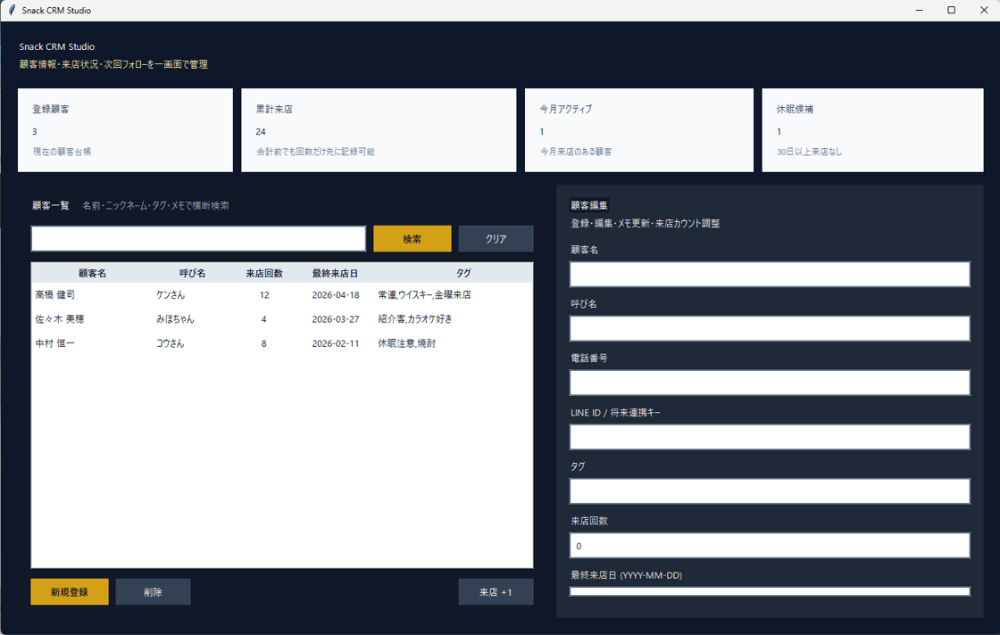

# Snack CRM Studio

ポートフォリオ公開を前提にした、`Python + tkinter + SQLite` 製のスナック向け顧客管理ツールです。  
紙台帳や Excel 管理を置き換える最小構成として、顧客登録・一覧・検索・来店回数・最終来店日・メモ管理を1画面で扱えるようにしました。


## 特徴

- 顧客登録 / 編集 / 削除
- 顧客一覧表示
- 名前・ニックネーム・タグ・メモを対象にした検索機能
- 来店回数管理
- 最終来店日管理
- 接客メモ管理
- 右側フォームのスクロール対応
- 一覧選択時の詳細表示と Enter キーによる選択反映
- ダッシュボードカードで主要状況を即確認
- 将来の LINE 配信連携を見据えたサービス分離構成

## スクリーンイメージ



- 上部にKPIカードを配置し、登録顧客数・累計来店数・今月アクティブ数・休眠候補数を可視化
- 左側に検索付きの顧客一覧、右側に編集フォームと顧客詳細を配置
- 右側フォームはスクロールできるため、画面高さが限られる環境でも保存・削除操作にアクセスしやすい
- ダークトーン + ゴールドアクセントで、業務ツールでありつつポートフォリオ映えする見た目に調整

## ディレクトリ構成

```text
.
├─ app.py
├─ snack_crm/
│  ├─ database.py
│  ├─ models.py
│  ├─ repository.py
│  ├─ services.py
│  └─ ui.py
└─ docs/
```

## アーキテクチャ

`tkinter` の単一ファイル実装に寄せず、将来拡張しやすいように責務を分離しています。

- `models.py`
  顧客モデルとダッシュボード用データ構造
- `database.py`
  SQLite 初期化、スキーマ作成、初回デモデータ投入、接続クローズ管理
- `repository.py`
  顧客データの CRUD / 検索 / 集計
- `services.py`
  業務ロジックと将来の LINE 配信 Gateway の注入ポイント
- `ui.py`
  `tkinter + ttk` ベースの GUI

将来的に LINE 配信管理を追加する場合は、`services.py` の `LineDeliveryGateway` を実装したクラスを差し込む構成です。  
そのため UI から直接 LINE API を呼ばず、顧客管理と外部連携を疎結合に保てます。

## セットアップ

```bash
python app.py
```

初回起動時に `data/snack_crm.db` が自動作成され、見た目確認用のサンプル顧客データも投入されます。  
公開用にまっさらな状態へしたい場合は `data/` を削除して再起動してください。

## 使い方

1. 右側フォームに顧客情報を入力して `保存`
2. 左側一覧から顧客を選択、または Enter キーで反映して内容を確認・編集
3. 検索ボックスで名前、タグ、メモなどを横断検索
4. `来店 +1` で来店回数と最終来店日を当日付で更新

## ポートフォリオ観点での見せどころ

- GUI アプリでも設計分離を行い、将来拡張を見据えた構成にしている
- SQLite を使ってローカル完結で試せる
- UI を単なるフォーム集ではなく、カード・配色・情報密度まで含めて整えている
- `docs/` の設計資料と合わせて、要件定義から UI 実装まで一貫して見せられる

## 今後の拡張候補

- LINE 友だち状態管理
- セグメント抽出
- 一斉配信 / 個別配信履歴
- 来店履歴テーブルの独立管理
- ボトルキープ管理
- CSV 入出力

## 開発メモ

- 依存ライブラリは使わず、標準ライブラリのみで動作
- GUI は Windows を意識しつつ、一般的な Python 環境で起動可能
- データ保存先はローカル SQLite のため、デモや審査提出にも扱いやすい構成
- SQLite 接続は `with` ブロック終了時に明示的にクローズされる
